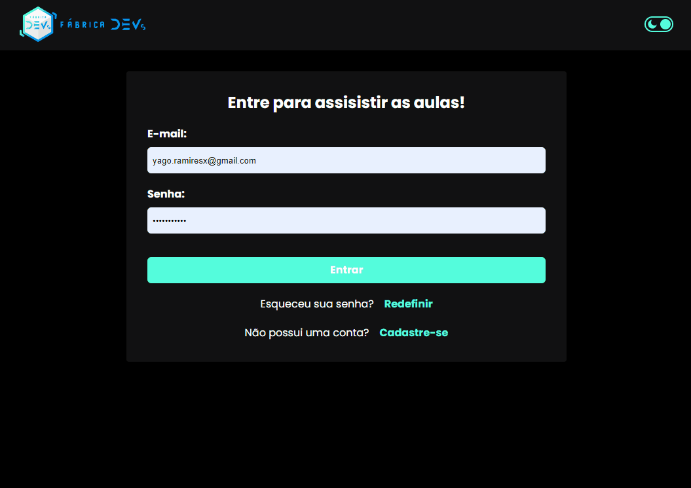
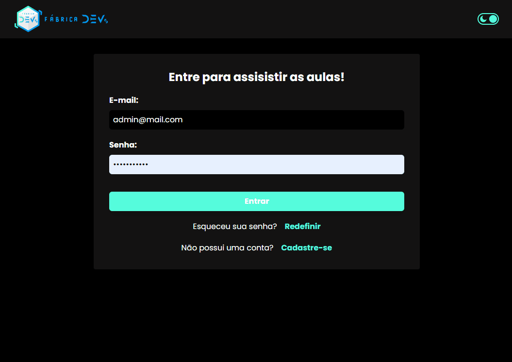

<h1 > Online Video Platform </h1>

<p>This platform uses React to create a modern and intuitive visual experience for users. It uses TailwindCSS to create responsive layouts and Firebase to store and retrieve data.</p>

<h2> Features: </h2>
<ul>
    <li>Login/signup for admins and users.</li>
    <li>Admins can add, edit, and delete videos.</li>
    <li>Admins can add, edit, and delete categories.</li>
    <li>Admins can handle with users and user type.</li>
    <li>Users can watch videos and download data.</li>
</ul>

<h2> Technologies: </h2>
<ul>
    <li>ReactJS</li>
    <li>Typescript</li>
    <li>TailwindCSS</li>
    <li>Google Firebase</li>
</ul>

<p align="center">


</p>

<h1> Testing this app </h1>

```bash
    # Clone repository
    $ git clone https://github.com/yagoramires/fabrika-devs.git
    # Access the repository folder
    $ cd fabrika-devs
    # Install the dependencies
    $ yarn
    # Run the application in development mode
    $ yarn start
    # The server will start on port:3000 - access http://localhost:3000/
```

<h1> Author </h1>

<div align="center" >
    <p>
        
    </p>
    <p>
        <a
            href="https://www.linkedin.com/in/yagoramires/"
            target="_blank"
            >
            
        </a>
    </p>
    <p>
        <a href="https://github.com/yagoramires" ><b>Yago Ramires</b> 🚀</a>
    </p>
</div>
